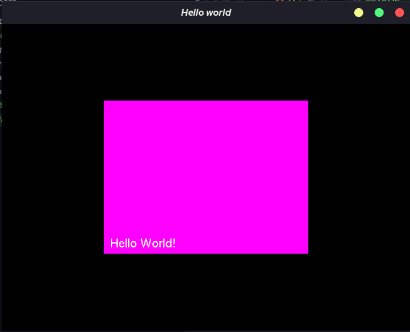

# helloWorld - OpenGL Beispiel

Dieses Beispiel wird in der Vorlesung Computergrafik an der DHBW-Karlsruhe verwendet.

## Vorraussetzungen
Unter Linux muss das Paket `freeglut-devel` installiert werden:
```shell
sudo dnf install freeglut-devel
```
## Manuelles Ausführen
Über die Kommandozeile muss nun die C-Datei kompiliert werden:
```shell
gcc helloWorld.c -o helloWorld -lglut -lGL -lGLU
```
Anschließend wird diese mit dem Kommando
```shell
./helloWorld   
```
ausgeführt werden.

Funktioniert alles, wird dieses Fenster angezeigt:


## Ausführen über Makefile
In der Kommandozeile den vorherigen Build-Prozess aufräumen:
```shell
make clean
```
Neuen Build-Prozess initiieren:
```shell
make
```
Applikation ausführen:
```shell
make all
```
